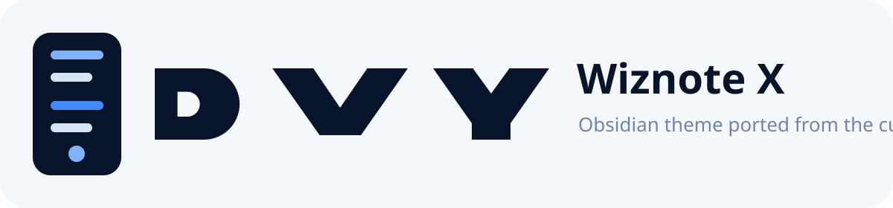
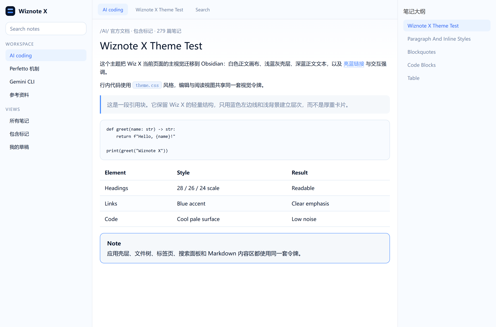
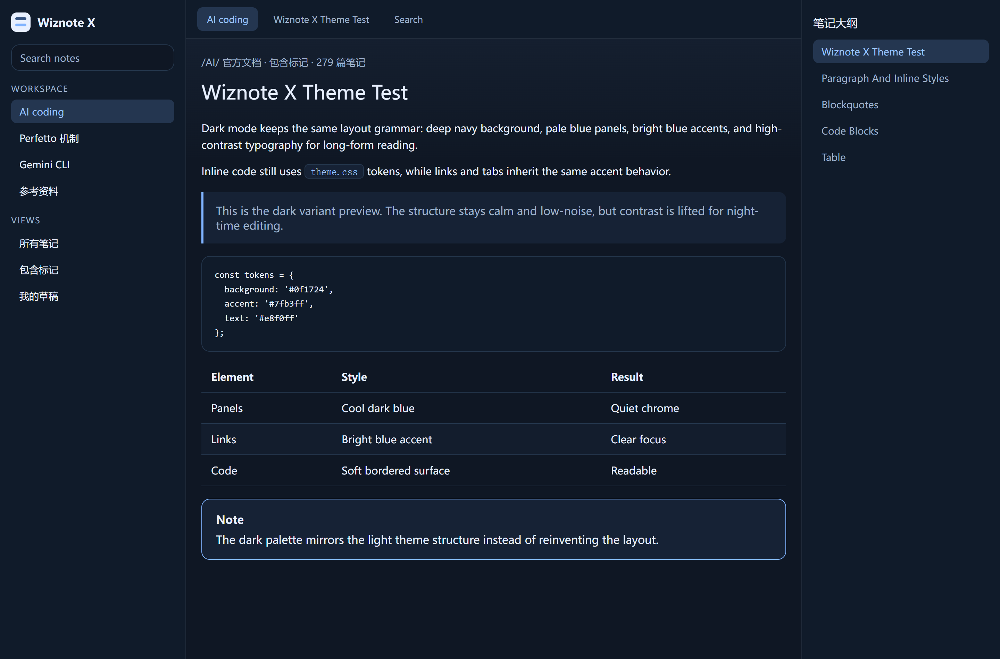

<p align="center">
  
</p>

<p align="center">
  
  
  
</p>

简体中文 | [English](README.en.md)

# Wiznote X Theme

Wiznote X Theme 是一个为 Obsidian 构建的完整主题仓库，目标是把 Wiz X Web 端当前的整套 Markdown 视觉语言迁移到本地 Obsidian 中。

它不只覆盖正文区，还统一处理 Obsidian 的左侧文件树、标签栏、搜索结果、右侧大纲、按钮、输入框、标签页、状态栏，以及阅读态与 Live Preview 的 Markdown 元素。整体视觉遵循 Wiz X 当前页面的关键特征：

- 纯白主画布与极浅蓝灰面板
- 深蓝正文文字与亮蓝强调色
- 紧凑但不压迫的标题与段落节奏
- 轻边框、低阴影、低装饰的界面壳层
- 一套统一覆盖应用壳层和 Markdown 内容区的 light / dark 双模式

## 预览

### Obsidian

<p align="center">
  
</p>

<p align="center">
  
</p>

## 支持的应用

| 应用 | 主题 | 状态 | 路径 |
|------|------|------|------|
| Obsidian | Wiznote X | ✅ 主线维护 | [`theme.css`](theme.css) + [`manifest.json`](manifest.json) |

## 自动安装

仓库根目录提供了一个轻量安装脚本 [`install.py`](install.py)：

```bash
python install.py obsidian
```

脚本会自动检测已打开或已配置的 vault，并将主题安装到所有检测到的 vault 中。

如果只想安装到单个 vault：

```bash
python install.py obsidian --vault "/path/to/your/vault"
```

## 手动安装

将 [`theme.css`](theme.css) 和 [`manifest.json`](manifest.json) 复制到 `<vault>/.obsidian/themes/Wiznote X/`，然后在 **设置 → 外观 → 主题** 中选择 **Wiznote X**。

## 主题特性

- 统一的应用壳层样式：文件树、标签、搜索、侧栏、大纲、按钮、输入框、标签页与状态栏
- 统一的 Markdown 样式：标题、段落、链接、列表、任务列表、引用、代码块、表格、脚注、Mermaid 与 callout
- Live Preview 与 Reading View 使用同一套视觉令牌，降低模式切换落差
- 基于 Wiz X 当前 Web 端的深蓝文本、亮蓝强调和轻量面板风格重构
- Obsidian root-level canonical source 布局，便于发布与安装

## 仓库结构

```text
wizx-theme/
├── .github/workflows/release.yml
├── docs/
│   ├── logo.svg
│   └── obsidian/
│       ├── dark.png
│       └── light.png
├── tests/
├── install.py
├── manifest.json
├── README.en.md
├── README.md
├── screenshot.png
├── theme.css
└── versions.json
```

## 验证

```bash
python -m unittest discover -s tests -v
```
