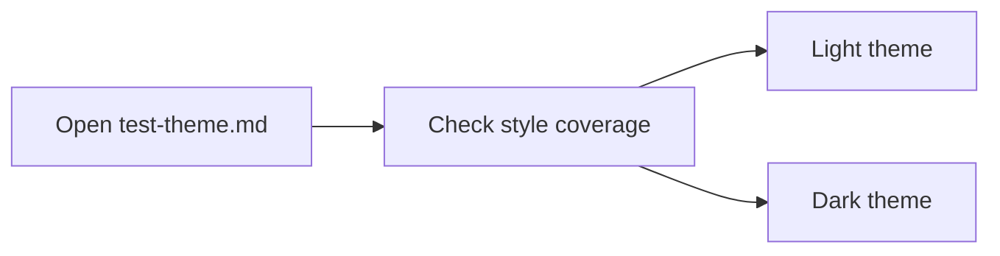

[TOC]

# Wiznote X Theme Test

This document is the canonical fixture for validating the Wiznote X Obsidian theme. It covers heading hierarchy, paragraph rhythm, list geometry, tables, code blocks, callouts, footnotes, math, images, and inline HTML.

## Heading Scale

# Heading Level 1

## Heading Level 2

### Heading Level 3

#### Heading Level 4

##### Heading Level 5

###### Heading Level 6

## Paragraph And Inline Styles

Paragraph text checks body font, line-height, spacing, and readable line width. It intentionally mixes **bold**, *italic*, ***bold italic***, ~~strikethrough~~, <u>underline</u>, ==highlight==, `inline code`, and an [external link](https://example.com).

This line mixes Chinese and English for rhythm checks: 正文需要同时支持中文、English, numbers `12345`, email `hello@example.com`, and a short path `theme.css`.

## Lists

- Unordered item A
- Unordered item B
  - Nested unordered item B.1
  - Nested unordered item B.2
    - Third-level unordered item B.2.1
    - Third-level unordered item B.2.2
      - Fourth-level unordered item
- Unordered item C
- A long mixed-language list item used to verify wrap alignment in both reading mode and editing mode: 这个列表项故意写得很长，包含 English phrases, 中文描述, numbers 123456, and a `code span` so the second visual line exposes any indentation drift immediately.

1. Ordered item 1
2. Ordered item 2
   1. Nested ordered item a
   2. Nested ordered item b
      1. Third-level ordered item i
      2. Third-level ordered item ii
         1. Fourth-level ordered item 1
         2. Fourth-level ordered item 2
3. Ordered item 3
4. Ordered item 4 with a long mixed-language wrap check: 这里同样故意写成长句，验证数字 marker、正文首行和换行后的第二行在编辑模式与阅读模式下是否从同一个文本起点开始。

- [ ] Pending task item
- [x] Completed task item
- [ ] Follow-up task item

### Heading Followed By Tasks

- [ ] Heading-scoped pending task
- [x] Heading-scoped completed task
  - [ ] Nested heading-scoped follow-up

- 无序列表项 A
- 无序列表项 B
  - 二级列表 B.1
  - 二级列表 B.2
    - 三级列表 B.2.1
    - 三级列表 B.2.2
      - 四级列表
- 无序列表项 C

1. 有序列表项 1
2. 有序列表项 2
   1. 二级有序 a
   2. 二级有序 b
      1. 三级有序 i
      2. 三级有序 ii
         1. 四级有序 1
         2. 四级有序 2
3. 有序列表项 3

## Blockquotes

> This is a blockquote used to verify border color, padding, paragraph color inheritance, and nested flow rhythm.
>
> It can also include **emphasis**, `inline code`, and [quote links](https://example.com/quote).
>
> > Nested quote level two keeps the same visual system.

## Alerts

> [!NOTE]
> This note callout validates neutral accent handling.

> [!TIP]
> This tip callout validates content spacing and border treatment.

> [!WARNING]
> This warning callout validates highlighted semantic treatment.

## Code Blocks

```python
from pathlib import Path


def greet(name: str) -> str:
    return f"Hello, {name}!"


print(greet("Wiznote X Theme"))
```

```bash
git status --short
python -m unittest discover -s tests -v
```

```json
{
  "theme": "wiznote-x",
  "variant": "light",
  "tokens": ["--background-primary", "--color-accent", "--wiz-accent-rgb"]
}
```

```css
:root {
  --background-primary: #ffffff;
  --color-accent: #448aff;
}
```

## Table

| Column | Content | Notes |
|------|------|------|
| Text | Plain text | Verify border, spacing, and row rhythm |
| Code | `inline code` | Verify inline code styling inside cells |
| Link | [Example](https://example.com) | Verify link color and underline styling |

## Rich HTML Table

<table>
  <thead>
    <tr>
      <th>Lists</th>
      <th>Ordered</th>
      <th>Code</th>
    </tr>
  </thead>
  <tbody>
    <tr>
      <td>
        <ul>
          <li>Cell bullet one</li>
          <li>Cell bullet two</li>
        </ul>
      </td>
      <td>
        <ol>
          <li>Cell ordered one</li>
          <li>Cell ordered two</li>
        </ol>
      </td>
      <td><code>inline code in a cell</code></td>
    </tr>
    <tr>
      <td><p>Paragraph text inside a rich table cell.</p></td>
      <td>
        <pre><code>cell code block
with two lines</code></pre>
      </td>
      <td><a href="https://example.com/table">Cell link</a></td>
    </tr>
    <tr>
      <td>
        <ul>
          <li>Nested cell bullet</li>
          <li><code>inline cell code</code></li>
        </ul>
      </td>
      <td>
        <pre><code>nested cell code
with Wiz-style rhythm</code></pre>
      </td>
      <td>
        <p>Cell paragraph followed by a list.</p>
        <ol>
          <li>Cell ordered alpha</li>
          <li>Cell ordered beta</li>
        </ol>
      </td>
    </tr>
  </tbody>
</table>

| 列名 | 内容 | 备注 |
|------|------|------|
| 文本 | 普通正文 | 检查表格边框和行高 |
| 代码 | `inline code` | 检查表格中的代码样式 |
| 链接 | [Example](https://example.com) | 检查表格中的链接颜色 |

## Horizontal Rule

---

## Footnotes

Here is one footnote reference[^theme-note], and here is another[^second-note].

[^theme-note]: This is the first footnote body.
[^second-note]: This is the second footnote body used to verify spacing between consecutive notes.

## Math

Inline math example: $E = mc^2$

Block math example:

$$
\int_{0}^{1} x^2 \, dx = \frac{1}{3}
$$

## Image


## Mermaid



## HTML Inline Elements

Keyboard style: <kbd>Ctrl</kbd> + <kbd>Shift</kbd> + <kbd>P</kbd>

Subscript and superscript: H<sub>2</sub>O and x<sup>2</sup>

## Closing Paragraph

If headings, body text, lists, blockquotes, callouts, code blocks, tables, images, footnotes, math, and Mermaid all render with a consistent WizNote-like rhythm, the theme is close to parity.
