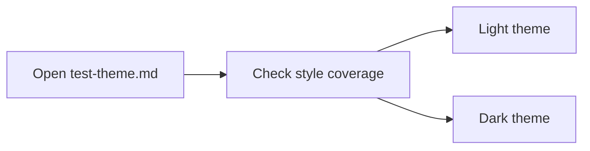

[TOC]

# Wiznote X Theme Test

这份文档用于集中检查 Wiznote X 主题在 Obsidian 中的常规 Markdown 样式覆盖，包括标题、段落、列表、表格、代码块、引用、脚注、数学公式、图片和扩展块元素。

## Heading Scale

# Heading Level 1

## Heading Level 2

### Heading Level 3

#### Heading Level 4

##### Heading Level 5

###### Heading Level 6

## Paragraph And Inline Styles

普通段落用于检查正文排版、行高、段距与阅读宽度。这里混合展示 **粗体**、*斜体*、***粗斜体***、~~删除线~~、<u>下划线</u>、==高亮==、`inline code` 和 [外部链接](https://example.com)。
也可以测试混排文本，例如中文、English, numbers `12345`, email `hello@example.com`, and a short path `theme.css`。

## Lists

- Unordered item A
- Unordered item B
  - Nested unordered item B.1
  - Nested unordered item B.2
    - Third-level unordered item B.2.1
    - Third-level unordered item B.2.2
      - Fourth-level unordered item
- Unordered item C

1. Ordered item 1
2. Ordered item 2
   1. Nested ordered item a
   2. Nested ordered item b
      1. Third-level ordered item i
      2. Third-level ordered item ii
         1. Fourth-level ordered item 1
         2. Fourth-level ordered item 2
3. Ordered item 3

- [ ] Pending task item
- [x] Completed task item
- [ ] Follow-up task item

- 无序列表项 A
- 无序列表项 B
  - 二级列表 B.1 (◦ circle)
  - 二级列表 B.2
    - 三级列表 B.2.1 (▪ square)
    - 三级列表 B.2.2
      - 四级列表 (● 循环回 disc)
- 无序列表项 C

1. 有序列表项 1 (1.)
2. 有序列表项 2
   1. 二级有序 (a.)
   2. 二级有序 (b.)
      1. 三级有序 (i.)
      2. 三级有序 (ii.)
         1. 四级有序 (1. 循环)
         2. 四级有序 (2. 循环)
3. 有序列表项 3

- [ ] 待完成任务
- [x] 已完成任务
- [ ] 需要回归检查的任务

## Blockquotes

> 这是一层引用块，用来检查引用边框、背景、阴影和正文颜色。
> 引用内也可以包含 **强调文本**、`inline code` 和 [引用链接](https://example.com/quote)。
> 嵌套引用示例：
> > 第二层引用块用于测试内层背景和边距。

## Alerts

> [!NOTE]
> 这是 Note 提示块，用于检查提示卡片样式。

> [!TIP]
> 这是 Tip 提示块，用于检查卡片文字与边框颜色。

> [!WARNING]
> 这是 Warning 提示块，用于检查高亮语义块在当前主题下的视觉一致性。

## Code Blocks

```python
from pathlib import Path


def greet(name: str) -> str:
    return f"Hello, {name}!"


print(greet("Wiznote X Theme"))
```

```bash
git status --short
python -m unittest discover -s tests -v
```

```json
{
  "theme": "wiznote-x",
  "variant": "light",
  "tokens": ["--background-primary", "--color-accent", "--wiz-accent-rgb"]
}
```

```css
:root {
  --background-primary: #ffffff;
  --color-accent: #448aff;
}
```

## Table

| Column | Content | Notes |
|------|------|------|
| Text | Plain text | Verify border, spacing, and row rhythm |
| Code | `inline code` | Verify inline code styling inside cells |
| Link | [Example](https://example.com) | Verify link color and underline styling |

## Rich HTML Table

<table>
  <thead>
    <tr>
      <th>Lists</th>
      <th>Ordered</th>
      <th>Code</th>
    </tr>
  </thead>
  <tbody>
    <tr>
      <td>
        <ul>
          <li>Cell bullet one</li>
          <li>Cell bullet two</li>
        </ul>
      </td>
      <td>
        <ol>
          <li>Cell ordered one</li>
          <li>Cell ordered two</li>
        </ol>
      </td>
      <td><code>inline code in a cell</code></td>
    </tr>
    <tr>
      <td><p>Paragraph text inside a rich table cell.</p></td>
      <td>
        <pre><code>cell code block
with two lines</code></pre>
      </td>
      <td><a href="https://example.com/table">Cell link</a></td>
    </tr>
  </tbody>
</table>

| 列名 | 内容 | 备注 |
|------|------|------|
| 文本 | 普通正文 | 检查表格边框和行高 |
| 代码 | `inline code` | 检查表格中的圆角胶囊 |
| 链接 | [Example](https://example.com) | 检查表格中的链接颜色 |

## Horizontal Rule

---

## Footnotes

脚注示例可以检查引用编号和脚注区域样式。这里有一个脚注[^theme-note]，这里还有第二个脚注[^second-note]。

[^theme-note]: 这是第一个脚注内容。
[^second-note]: 这是第二个脚注内容，用来检查多条脚注之间的间距。

## Math

行内公式示例：$E = mc^2$

块级公式示例：

$$
\int_{0}^{1} x^2 \, dx = \frac{1}{3}
$$

## Image


## Mermaid



## HTML Inline Elements

按键样式：<kbd>Ctrl</kbd> + <kbd>Shift</kbd> + <kbd>P</kbd>

上下标：H<sub>2</sub>O 与 x<sup>2</sup>

## Closing Paragraph

如果这份文档中的标题、正文、列表、引用、提示块、代码块、表格、图片、脚注、数学公式和 Mermaid 都显示正常，说明主题的常见 Markdown 样式覆盖已经比较完整。
